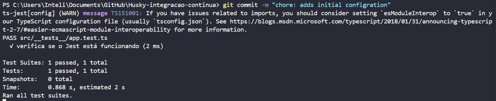
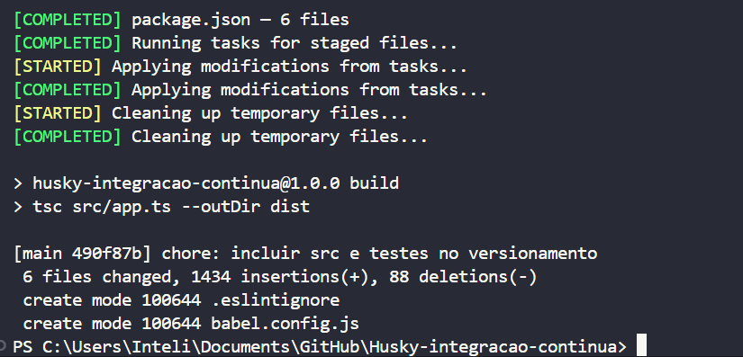
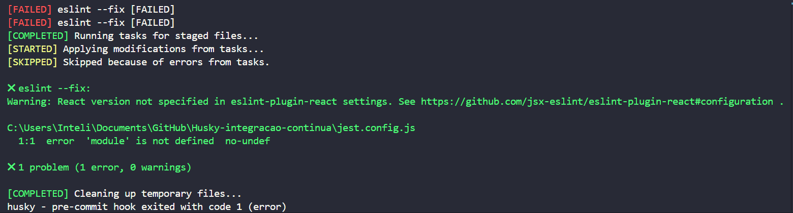

# Relatório Técnico de Integração Contínua com Husky, ESLint e Jest

## 1. Introdução

&emsp;&emsp;Este relatório documenta o processo de configuração de um ambiente de desenvolvimento com **Integração Contínua Local**, utilizando Husky, ESLint, Prettier e Jest.

&emsp;&emsp;O foco está na automação de validações de qualidade de código e testes antes de qualquer commit ou push ao repositório Git, contribuindo para a consistência e estabilidade do projeto.

## 2. Stack Tecnológica Utilizada

- **Linguagem:** JavaScript / TypeScript
- **Framework de testes:** Jest
- **Análise estática e formatação:** ESLint + Prettier
- **Gerenciador de pacotes:** npm
- **Ferramentas de Git Hooks:** Husky + lint-staged
- **Ambientes-alvo:** Browser (React) e Node.js (scripts de configuração)

## 3. Configuração do Husky

&emsp;&emsp;O **Husky** foi configurado para interceptar ações de Git (`pre-commit`, `pre-push`) e executar tarefas automatizadas. Os passos para configuração foram:

```bash
npm install husky --save-dev
npx husky install
npm pkg set scripts.prepare="husky install"
```

**Hooks configurados:**

- **pré-commit:** Executa ESLint e Prettier em arquivos staged via `lint-staged`
- **pré-push:** Executa os testes com Jest.

---

**Exemplo do `.husky/pre-commit`**

```bash
#!/usr/bin/env sh
. "$(dirname -- "$0")/_/husky.sh"

npx lint-staged
npm run build
```

<div align="center">
  <sub>Figura 1: Pré-commit funcional</sub><br>
  <br>
  <sup>Fonte: Anna Aragão (2025)</sup>
</div>

---

**Exemplo do `.husky/pre-push`**

```bash
#!/usr/bin/env sh
. "$(dirname -- "$0")/_/husky.sh"

npm test
```

<div align="center">
  <sub>Figura 2: Pré-push funcional com build</sub><br>
  <br>
  <sup>Fonte: Anna Aragão (2025)</sup>
</div>

## 4. Configuração do Lint-Staged e Prettier

&emsp;&emsp;No `package.json`, foi definida a seguinte configuração:

```json
"lint-staged": {
  "*.{js,jsx,ts,tsx}": ["eslint --fix", "prettier --write"],
  "*.{json,md,yml,yaml}": ["prettier --write"]
}
```

&emsp;&emsp;O objetivo é garantir que apenas os arquivos modificados passem pelas validações de lint e formatação antes de serem comitados.

## 5. Configuração do ESLint

&emsp;&emsp;Foi adotado o ESLint com suporte a **React**, **TypeScript**, e múltiplos ambientes (browser e Node.js).

---

**Principais pacotes utilizados**

- `eslint`

- `@typescript-eslint/parser`

- `@typescript-eslint/eslint-plugin`

- `eslint-plugin-react`

- `eslint-config-prettier`

---

**Orgaização do ambiente**

- Os arquivos `.tsx`, `.ts`, `.jsx` e `.js` foram configurados para ambiente **browser**.

- Arquivos como `jest.config.js` e `babel.config.js` foram identificados como parte do ambiente **Node**, sendo tratados com `overrides`.

---

**Exemplo de configuração com múltiplos ambientes**

```json
"overrides": [
  {
    "files": ["*.config.js", "*.cjs"],
    "env": {
      "node": true
    },
    "rules": {
      "no-undef": "off"
    }
  }
],
"ignorePatterns": ["babel.config.js", "jest.config.js", "dist/", "build/"]
```

## 6. Configuração do Jest

&emsp;&emsp;O Jest foi configurado como principal ferramenta de testes da aplicação. O comando `npm run test` é executado automaticamente antes de cada `git push`, garantindo que nenhum código com falhas de teste chegue ao repositório remoto.

**Exemplo de `jest.config.js`**

```js
module.exports = {
  testEnvironment: "jsdom",
  transform: {
    "^.+\\.tsx?$": "ts-jest",
  },
};
```

<div align="center">
  <sub>Figura 3: Teste do Jest</sub><br>
  <br>
  <sup>Fonte: Anna Aragão (2025)</sup>
</div>

## 7. Erros Encontrados e Soluções Aplicadas

&emsp;&emsp;Durante o processo de configuração, alguns problemas foram identificados:

**Erro 1:** `no-undef` **em arquivos de configuração**

**Causa:** ESLint estava configurado apenas para ambiente browser.

**Solução:** Utilização de `overrides` para arquivos `.js` e `.cjs`, configurando o ambiente como Node.

---

**Erro 2:** `Plugin "" not found`

**Causa:** Problemas ao tentar configurar o `eslint.config.js` com plugins não compatíveis.

**Solução:** Utilização do `eslint.config.mjs` como estrutura.

---

**Erro 3:** `defineConfig` **não encontrado**

**Causa:** Tentativa de uso da função `defineConfig` de forma incompatível com módulos CommonJS.

**Solução:** Padronização da configuração com `.eslintrc.json ` tradicional.

<div align="center">
  <sub>Figura 4: Exemplo de erro</sub><br>
  <br>
  <sup>Fonte: Anna Aragão (2025)</sup>
</div>

## 8. Conclusão

&emsp;&emsp;A configuração de uma pipeline local de integração contínua com Husky, ESLint, Prettier e Jest foi muito eficaz na prevenção de possíveis erros e na manutenção da qualidade do código.

&emsp;&emsp;Ao final, acredito que consegui captar como essa abordagem promove boas práticas de engenharia de software, além de conseguir ter uma ideia de automatizar verificações críticas para CI/CD.
